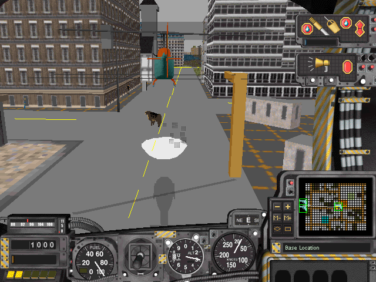
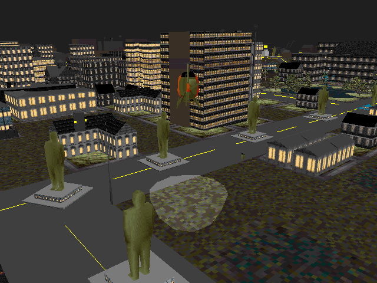
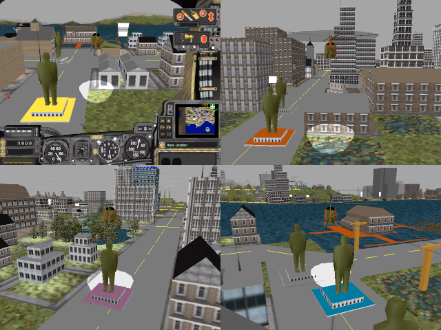

# Maxis Mods

Silly little mods for SimCopter and Streets of SimCity.

Recommended for use with [SimCopterX](http://simcopter.net) or [SimStreetsX](http://www.streetsofsimcity.com/), which not only patch both games to ensure reliable operation when run under modern versions of Windows but also ensure that they use local resource files.

Install each mod by replacing the appropriate file(s) in the `geo` folder (for `.max` files) and/or `bmp` folder (for `.bmp` files) with those provided.

For example, given a mod file called `sim3d2-simcopter-mod-name.max`, remove the original `sim3d2.max` file from SimCopter's `geo` folder, rename the mod file to remove the suffix, and place a copy of it in the `geo` folder to replace the original `sim3d2.max` file.

# SimCopter

## Trouble Train

All aboard the trouble train!

### Files:
* `/simcopter/trouble-train/sim3d2-simcopter-trouble-train.max` (replaces `geo/sim3d2.max`)

### Notes:
* The trouble train was created by programmatically increasing the y coordinate of the roof vertices of the train car meshes in the `sim3d2.max` file.
* Conveniently, people are still placed on the roof of the train (rather than at the original roof height) during train rescue missions; otherwise they would be impossible to retrieve. Presumably their position is specified relative to one of the roof vertices or the height of the mesh is calculated at runtime.
* The trouble train is not without some degree of historical precedent. During the 19th century, three-storey bunk cars saw limited use as part of construction trains in North America.

* A video of the trouble train is available [here](readme-assets/trouble-train.mp4).

## Cattle Rustler

What is this, [SimFarm](https://en.wikipedia.org/wiki/SimFarm)?

### Files
* `/simcopter/cattle-rustler/sim3d2-simcopter-cattle-rustler.max` (replaces `geo/sim3d2.max`)
* `/simcopter/cattle-rustler/sim3d-simcopter-cattle-rustler.bmp` (replaces `bmp/sim3d.bmp`)

### Notes
* Replacing the burglar's [coupé utility vehicle](https://en.wikipedia.org/wiki/Coup%C3%A9_utility) with the cow from Streets of SimCity required a few changes:
  * I extracted the cow texture from Streets' `sim3d.bmp` file and added it to SimCopter's `sim3d.bmp` file using my [Maxis Texture Tool](https://github.com/CahootsMalone/maxis-texture-tool) program.
  * With a mix of programmatic and manual editing, I extracted the cow mesh from Streets' `sim3d1.max` file and replaced the burglar's car with it in SimCopter's `sim3d2.max` file.
    * I rotated the cow mesh to make it point forward and changed its texture indices to reference the location of the cow texture in the modified `sim3d.bmp` file.
    * Replacing the burglar's car with the cow in the `.max` file required a number of changes; see my notes regarding mesh replacement [here](https://github.com/haffmans/Maxis-formats/blob/master/experiments/README.md), specifically the `sim3d2_simcopter_replacement_test_1.max` section.
* Regrettably, making the cow moo at regular intervals would require code changes.
* A video of the cattle rustler is available [here](readme-assets/cattle-rustler.mp4).

## Sensational Statues

Overcome by megalomania, the mayor has flooded the streets with self-propelled statues of himself and banned private vehicles.

### Files
* `/simcopter/sensational-statues/sim3d2-simcopter-sensational-statues.max` (replaces `geo/sim3d2.max`)

### Notes
* Random statues are rendered with a coloured base, presumably because the game varies the colour of some instances of a given vehicle model by modifying the palette (or palette indices) when rendering them. Textured faces and those rendered with shading don't seem to be affected.

# Streets of SimCity

None yet.