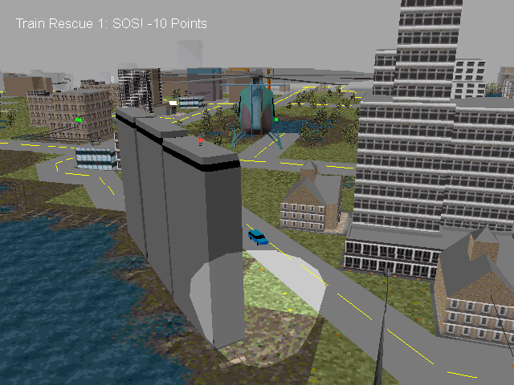
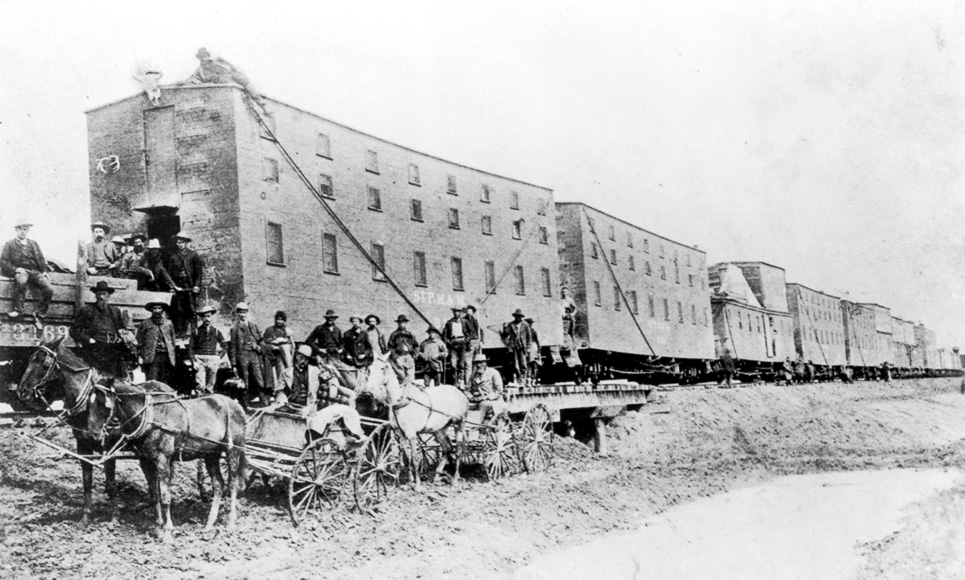

# Maxis Mods

Silly little mods for SimCopter and Streets of SimCity.

Recommended for use with [SimCopterX](http://simcopter.net) or [SimStreetsX](http://www.streetsofsimcity.com/), which not only patch both games to ensure reliable operation when run under modern versions of Windows but also ensure that they use local resource files.

Install each mod by replacing the appropriate file(s) in the `geo` folder (for `.max` files) and/or `bmp` folder (for `.bmp` files) with those provided.

For example, given a mod file called `sim3d2-simcopter-mod-name.max`, remove the original `sim3d2.max` file from SimCopter's `geo` folder, rename the mod file to remove the suffix, and place a copy of it in the `geo` folder to replace the original `sim3d2.max` file.

# SimCopter

## Trouble Train

All aboard the trouble train!

### Files:
* `/simcopter/trouble-train/sim3d2-simcopter-trouble-train.max`

### Notes:
* The trouble train was created by programmatically increasing the y coordinate of the roof vertices of the train car meshes in the `sim3d2.max` file.
* Conveniently, people are still placed on the roof of the train (rather than at the original roof height) during train rescue missions; otherwise they would be impossible to retrieve. Presumably their position is specified relative to one of the roof vertices or the height of the mesh is calculated at runtime.
* The trouble train is not without some degree of historical precedent. During the 19th century, three-storey bunk cars saw limited use as part of construction trains in North America.

* A video of the trouble train is available [here](readme-assets/trouble-train.mp4).

# Streets of SimCity

None yet.