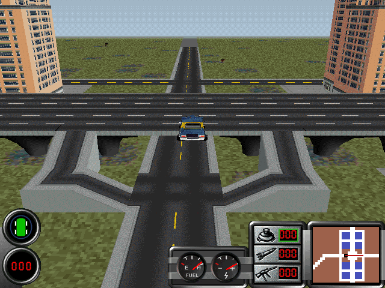

# Maxis Mods

Silly little mods for SimCopter and Streets of SimCity.

Recommended for use with [SimCopterX](http://alekasm.com/scx.html) or [SimStreetsX](http://alekasm.com/ssx.html), which not only patch both games to ensure reliable operation when run under modern versions of Windows but also ensure that they use local resource files.

Install each mod by replacing the appropriate file(s) in the `geo` folder (for `.max` files) and/or `bmp` folder (for `.bmp` files) with those provided.

For example, given a mod file called `sim3d2-simcopter-mod-name.max`, remove the original `sim3d2.max` file from SimCopter's `geo` folder, rename the mod file to remove the suffix, and place a copy of it in the `geo` folder to replace the original `sim3d2.max` file.

# Mod List

* SimCopter
  * [Trouble Train](#trouble-train)
  * [Cattle Rustler](#cattle-rustler)
  * [Sensational Statues](#sensational-statues)
  * [Wanted Wienermobile](#wanted-wienermobile)
  * [Ridiculous Rodents](#ridiculous-rodents)
* Streets of SimCity
  * [Custom Scenario Demo](#custom-scenario-demo)
  * [Elevated Highways](#elevated-highways)

# SimCopter

## Trouble Train

All aboard the trouble train!

### Files:
* `/simcopter/trouble-train/sim3d2-simcopter-trouble-train.max` (replaces `geo/sim3d2.max`)

### Notes:
* The trouble train was created by programmatically increasing the y coordinate of the roof vertices of the train car meshes in the `sim3d2.max` file.
* Conveniently, people are still placed on the roof of the train (rather than at the original roof height) during train rescue missions; otherwise they would be impossible to retrieve. Presumably their position is specified relative to one of the roof vertices or the height of the mesh is calculated at runtime.
* The trouble train is not without some degree of historical precedent. During the 19th century, three-storey bunk cars saw limited use as part of construction trains in North America.

* A video of the trouble train is available [here](readme-assets/trouble-train.mp4).

## Cattle Rustler

What is this, [SimFarm](https://en.wikipedia.org/wiki/SimFarm)?

### Files
* `/simcopter/cattle-rustler/sim3d2-simcopter-cattle-rustler.max` (replaces `geo/sim3d2.max`)
* `/simcopter/cattle-rustler/sim3d-simcopter-cattle-rustler.bmp` (replaces `bmp/sim3d.bmp`)

### Notes
* Replacing the burglar's [coupé utility vehicle](https://en.wikipedia.org/wiki/Coup%C3%A9_utility) with the cow from Streets of SimCity required a few changes:
  * I extracted the cow texture from Streets' `sim3d.bmp` file and added it to SimCopter's `sim3d.bmp` file using my [Maxis Texture Tool](https://github.com/CahootsMalone/maxis-texture-tool) program.
  * With a mix of programmatic and manual editing, I extracted the cow mesh from Streets' `sim3d1.max` file and replaced the burglar's car with it in SimCopter's `sim3d2.max` file.
    * I rotated the cow mesh to make it point forward and changed its texture indices to reference the location of the cow texture in the modified `sim3d.bmp` file.
    * Replacing the burglar's car with the cow in the `.max` file required a number of changes; see my notes regarding mesh replacement [here](https://github.com/haffmans/Maxis-formats/blob/master/experiments/README.md), specifically the `sim3d2_simcopter_replacement_test_1.max` section.
* Regrettably, making the cow moo at regular intervals would require code changes.
* A video of the cattle rustler is available [here](readme-assets/cattle-rustler.mp4).

## Sensational Statues

Overcome by megalomania, the mayor has flooded the streets with self-propelled statues of himself and banned private vehicles.

### Files
* `/simcopter/sensational-statues/sim3d2-simcopter-sensational-statues.max` (replaces `geo/sim3d2.max`)

### Notes
* Random statues are rendered with a coloured base, presumably because the game varies the colour of some instances of a given vehicle model by modifying the palette (or palette indices) when rendering them. Textured faces and those rendered with shading don't seem to be affected.

## Wanted Wienermobile

Some nefarious hooligan has stolen the [Oscar Mayer Wienermobile](https://en.wikipedia.org/wiki/Wienermobile)!

(This mod replaces the burglar's car with everyone's favourite vehicular tribute to processed meat.)

### Files
* `/simcopter/wienermobile/sim3d2-simcopter-wienermobile.max` (replaces `geo/sim3d2.max`)

### Notes
* This model is based on the 1952 version of the wienermobile, which seemed the best fit for SimCopter's style (photos by Wikipedia users Mrmiscellanious \[sic\] and Gregory Varnum).

* I created the model of the wienermobile using [Blender](https://www.blender.org/), which I then exported to the SimCopter mesh format using a [Python script](https://github.com/CahootsMalone/maxis-mesh-stuff/blob/master/Python/Blender-export-script/blender-export-script.py) I wrote (Blender has a comprehensive [Python API](https://docs.blender.org/api/current/index.html)).

* A video of the wienermobile is available [here](readme-assets/wienermobile.mp4).

## Ridiculous Rodents

The rat from [3D Movie Maker](https://en.wikipedia.org/wiki/3D_Movie_Maker) pays a visit to SimCopter.

### Files
* `/simcopter/ridiculous-rodents/sim3d2-simcopter-rats.max` (replaces `geo/sim3d2.max`)
* `/simcopter/ridiculous-rodents/sim3d-simcopter-rats.bmp` (replaces `bmp/sim3d.bmp`)

### Notes
* This mod replaces all civilian vehicles with Fabrice the rat from 3D Movie Maker. Like SimCopter, 3D Movie Maker was a piece of software I greatly enjoyed as a child.
* See [this repo](https://github.com/CahootsMalone/3d-movie-maker-stuff) for my reverse engineering work related to 3D Movie Maker, including [the script used to process the binary files containing the rat model](https://github.com/CahootsMalone/3d-movie-maker-stuff/blob/master/scripts/rat-to-wavefront-obj.py).
* A video of the rats in action is available [here](readme-assets/ridiculous-rodents.mp4).

# Streets of SimCity

## Custom Scenario Demo

This isn't technically a mod, but I reverse-engineered the binary format used to store scenarios, wrote some Python scripts to faciliate the creation of new scenarios, and made a little demonstration scenario.

### Files
* `CustomScenarioDemo.scn` (download [here](https://github.com/CahootsMalone/maxis-streets-scenario-stuff/blob/master/scripts/scenario-creation/CustomScenarioDemo.scn)): place this file in the `<Streets of SimCity directory>\scenarios\Movie` folder.
* `CustomScenarioDemo.sc2` (download [here](https://github.com/CahootsMalone/maxis-streets-scenario-stuff/blob/master/scripts/scenario-creation/CustomScenarioDemo.sc2)): the SimCity 2000 city file for the custom scenario. Place this file in the `<Streets of SimCity directory>\Cities` folder.

### Notes
* Want to create your own scenarios? Read [this](https://github.com/CahootsMalone/maxis-streets-scenario-stuff/blob/master/README.md).

## Elevated Highways

Highways that more closely resemble the ones depicted in SimCity 2000.

Comparison (original models on the left; the original on-ramps are quite strange):

### Files
* [`/streets/elevated-highways/SIM3D1-streets-elevated-highways.MAX`](streets/elevated-highways/SIM3D1-streets-elevated-highways.MAX) (replaces `GEO/SIM3D1.MAX`)
* [`/streets/elevated-highways/SIM3D3-streets-elevated-highways.MAX`](streets/elevated-highways/SIM3D3-streets-elevated-highways.MAX) (replaces `GEO/SIM3D3.MAX`)

### Notes
* My original design used straight support columns rather than the tapered ones in the final mod. Although the straight columns were a better match for the sprites in SimCity 2000, they were affected by the poor depth culling in Streets (both Streets and SimCopter seem to have a fairly low-resolution depth buffer) and ended up being rather unsightly (screenshot below). The tapered supports result in a mesh that's closer to  being convex and less susceptible to this problem.

* As shown in the screenshot below, the deck of the new highway bridge model has no bottom face. Collision volumes for the highway models appear to be generated dynamically (e.g., the new on-ramp model doesn't have a separate collision mesh and [the model format has no way to specify one](https://github.com/CahootsMalone/maxis-mesh-stuff/blob/master/Info/Maxis-Mesh-Format.md#object-objx)); when a bottom face was included for the bridge deck, the deck wasn't solid (vehicles simply fell through it). I tried various alternative geometries but removing the bottom face was the only solution I found.

* The collision volumes generated for overpass models don't account for the road passing beneath the highway; the result is that vehicles attempting to travel underneath the highway are thrown into the air. This is shown near the end of the video linked below. 
* A video demonstrating this mod is available [here](readme-assets/elevated-highways.mp4).